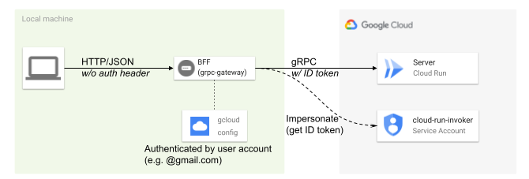

# grpc-private-bff-example

:warning: !!! DO NOT USE IN PRODUCTION !!! :warning:



## Usage

- You need to have
    - a valid GCP account
        - authenticated by `gcloud auth application-default login`
    - Docker environment in your local machine

### Server

- Deploy server to Cloud Build

```bash
PROJECT_ID=xxx make deploy
```

- Remember Cloud Run service **domain** (exclude `https://` from service **URL**)
    - e.g. `xxx-yyy.a.run.app`
- Create service account `cloud-run-invoker@<PROJECT_ID>.iam.gserviceaccount.com`
- Grant `roles/run.invoker` role of the deployed Cloud Run app to the above service a ccount
- Grant `roles/iam.serviceAccountTokenCreator` of the above service account to your GCP user account
    - Note that `roles/owner` does NOT have permission to impersonate a certain service account (i.e. `iam.serviceAccounts.getAccessToken`)

### BFF

- Run BFF
    - `CLOUD_RUN_ENDPOINT`: The Cloud Run app **domain**
    - `IMPERSONATE_SA_EMAIL`: The email address of the above service acccount

```bash
make build-bff-image
CLOUD_RUN_ENDPOINT=xxx-yyy.a.run.app IMPERSONATE_SA_EMAIL=cloud-run-invoker@xxx.iam.gserviceaccount.com make run-bff-image
```

- Call service endpoint through BFF

```sh-session
$ curl localhost:8080/v1/hello/sayhello/dtan4
{"message":"Hello, dtan4"}
```
